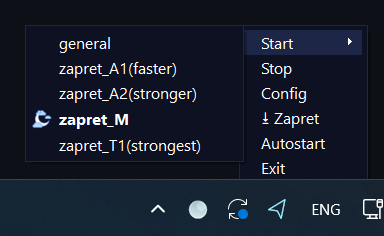

# Moonstone
A desktop app for `bol-van/zapret`



## Quick Start

### Running in Debug Mode
```bash
python -m src.main
```
**Note:** Requires administrator privileges.

### Building
```bash
pyinstaller --onedir --noconsole --name Moonstone --add-data "icons;icons" --add-data "zapret;zapret" --icon=icons/moonstone.ico --version-file=version.py src/main.py
```

For detailed information on development, debugging, and building, see [DEVELOPMENT.md](DEVELOPMENT.md).